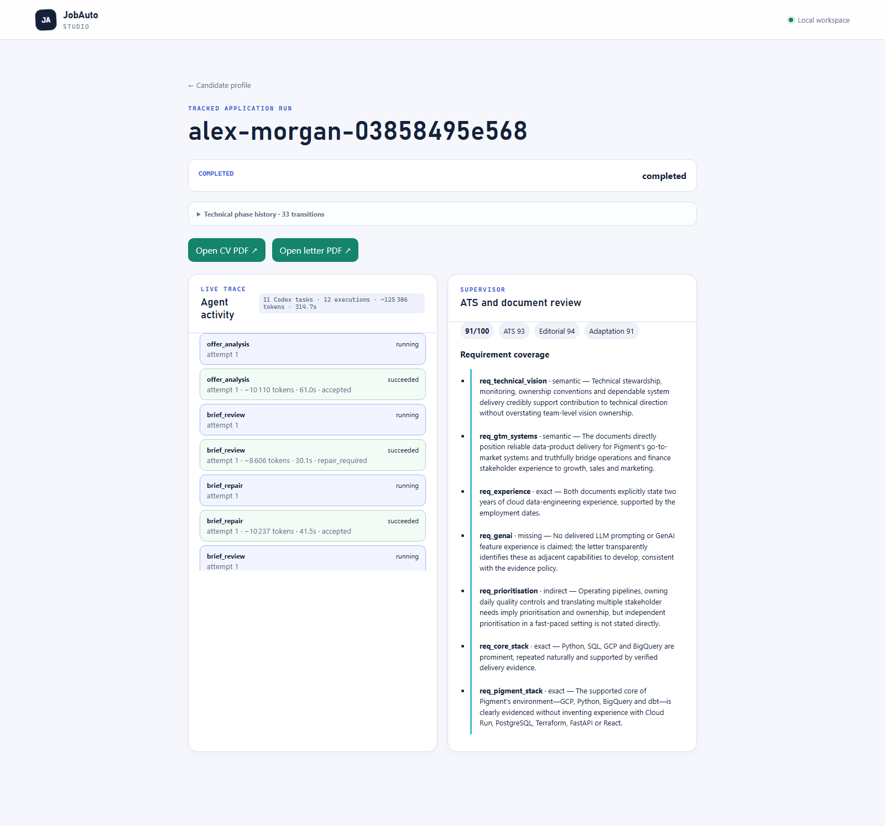

# JobAuto Studio

JobAuto Studio turns one trusted CV into reviewed, role-specific application
packets. It can find relevant jobs, compare each offer with the candidate's
profile, tailor the CV and cover letter, validate the real PDFs, and prepare the
application in the candidate's own Chrome session.

[Watch the 2:51 demo](https://youtu.be/-1IRuEl3qJU) ·
[View the Devpost project](https://devpost.com/software/jobauto-studio)



## Why it exists

Adapting a CV is useful only when the result stays truthful, readable and easy
to review. JobAuto separates that work into three layers:

- **Codex understands the offer** and chooses the role angle, ATS terms,
  relevant evidence and writing strategy.
- **Deterministic checks protect the documents**: source integrity, one-page
  layout, readable text, identity, filenames and hashes.
- **The candidate stays in control** of facts, adaptation freedom and how far
  browser automation may go.

## What it does

1. Import a LaTeX CV, extract selectable text from a PDF, or create a profile
   from structured blocks.
2. Review the extracted experience, projects, skills and job preferences.
3. Choose how freely each CV section may be adapted.
4. Search for current roles and rank them against the saved profile.
5. Build an ATS brief, select evidence, and write a tailored CV and letter.
6. Compile and inspect the actual PDFs, then review or repair the result.
7. Queue approved packets for the JobAuto Codex plugin, which uses the
   candidate's authenticated Chrome session and records the outcome.

The dashboard keeps the source CV, tailored documents, ATS scores, agent
events, review decisions, hashes and application status together.

## Try it locally

### Requirements

- Python 3.11 or newer
- [uv](https://docs.astral.sh/uv/)
- a LaTeX distribution with `pdflatex`
- Codex CLI authenticated on the machine

On a minimal Debian or Ubuntu installation, also install `cm-super` and
`poppler-utils`.

### Start Studio

```powershell
git clone https://github.com/Rapha1503/jobauto-studio.git
cd jobauto-studio
uv sync --extra dev
uv run jobauto studio
```

Studio opens at `http://127.0.0.1:8765`.

Choose **Explore the checked demo** for a self-contained synthetic campaign.
It makes no model call and does not contact an employer. Choose **Create my
profile** to run the live workflow with your own documents and preferences.

The default agent model is `gpt-5.6-sol`. It can be changed explicitly:

```powershell
uv run jobauto studio --codex-model gpt-5.6-sol --state-root .jobauto-state
```

The `JOBAUTO_CODEX_MODEL` environment variable provides the same setting.
Studio displays the selected model and records it in run telemetry.

## Chrome application handoff

Browser control remains outside the FastAPI server. Install the bundled JobAuto
plugin from the source checkout:

```powershell
codex plugin marketplace add .
codex plugin add jobauto@jobauto-studio
```

The plugin reads reviewed packets from the local Studio queue and works through
the user's Chrome session. Before uploading a local PDF, enable **Allow access
to file URLs** in the ChatGPT Chrome Extension details page.

Login, CAPTCHA, 2FA, unusual consent and ambiguous questions follow the
candidate's submission policy. The included sandbox proves packet selection,
file upload, receipt persistence and hash continuity; it is not presented as an
employer submission.

## Technical design

- **FastAPI + Jinja** serve the local Studio interface.
- **Pydantic** defines candidate, offer, adaptation and submission contracts.
- **Codex CLI with GPT-5.6** handles discovery, offer analysis, strategy,
  writing, independent review and repair.
- **LaTeX, Poppler and pypdf** compile and inspect the real documents.
- **Local JSON/filesystem state** stores profiles, runs, artifacts and receipts.
- **The Codex Chrome Extension** handles authenticated browser interaction.

The candidate profile is built once and passed explicitly to every agent phase.
The public package contains only generic code and synthetic examples; it does
not include a private CV or application history.

### LaTeX and PDF inputs

A `.tex` file remains the layout source of truth: JobAuto preserves its
preamble, packages, macros and structure while editing approved content blocks.

A PDF is an extraction source, not an editable layout source. The flow is:

```text
PDF -> page text with provenance -> candidate review -> generated LaTeX layout
```

Scanned PDFs without useful text fall back to the manual editor.

## Verification

```powershell
uv run ruff check .
uv run ruff format --check .
uv run pytest -q
uv build
uv run jobauto audit-release .
uv run jobauto audit-release dist/jobauto-0.1.0-py3-none-any.whl
```

The test suite covers candidate isolation, ATS scoring, prompt inputs,
source-preserving LaTeX, real PDF compilation, review and repair, discovery,
campaigns, Chrome handoffs and the public-release privacy audit. CI uses
deterministic agent adapters; checked real-agent traces are published separately
so a normal test run does not spend model tokens.

## Checked evidence

- [Five-application cross-domain campaign](docs/demo-evidence/20260718-nonit-chrome-batch/README.md)
- [Smallest continuous end-to-end trace](docs/demo-evidence/20260718-atomic-e2e/README.md)
- [Chrome Extension sandbox proof](docs/demo-evidence/20260718-chrome-extension-sandbox/README.md)
- [ATS scoring contract](docs/ATS_SCORING.md)
- [Build Week scope and provenance](docs/BUILD_WEEK_SCOPE.md)

Run `uv run jobauto audit-release .` to scan the source tree for personal data,
secrets, private keys, user-specific paths and non-example contact details.

## License

[MIT](LICENSE)
