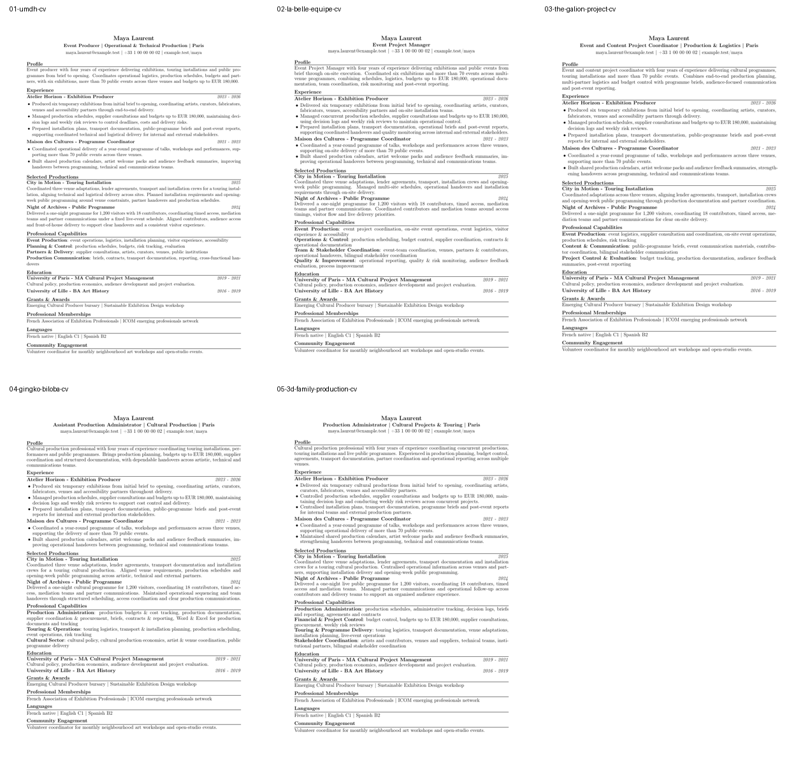
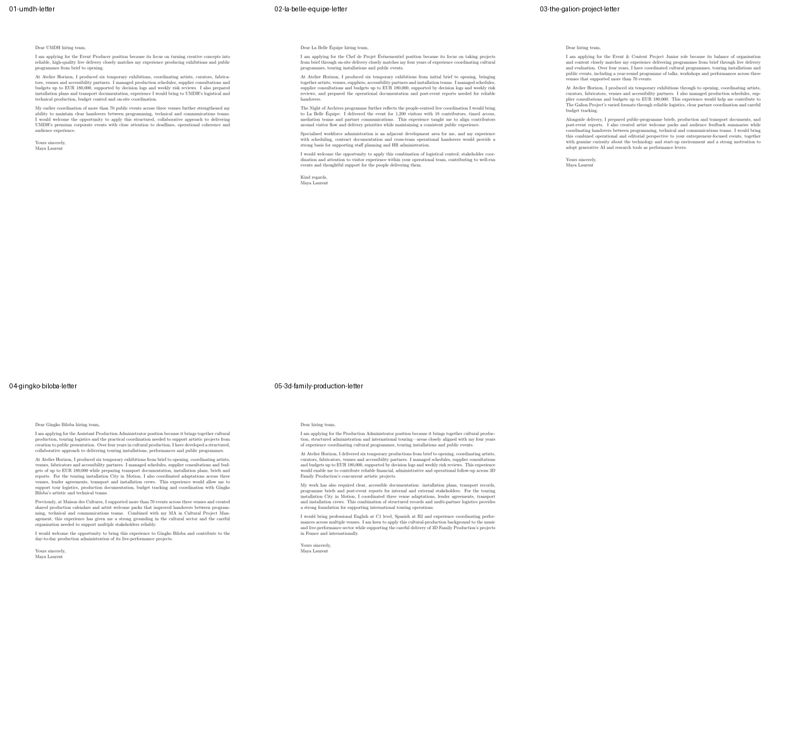

# Non-IT Chrome Extension batch evidence - 2026-07-18

This proof uses only the synthetic `Maya Laurent` cultural-production profile.
It demonstrates that the generic campaign and Chrome handoff contract are not
limited to Data or software-engineering roles. No employer application was
submitted.

## Proven path

```text
non-technical candidate profile
  -> web discovery and full offer capture
  -> five completed application packages
  -> ten reviewed one-page PDFs
  -> five exact Chrome handoffs
  -> candidate fields and approved letter text entered in Chrome
  -> exact CV and letter files selected
  -> five hash-verified sandbox receipts
```

The five packets cover event production, event project management, cultural
production administration and content coordination. Every receipt contains
four filled fields, two uploaded files, no blocker and no warning. The exact
artifact hashes are recorded in [`receipts-summary.json`](receipts-summary.json).

The source campaign ranked nine offers and retained five. All five selected
runs completed with one-page CVs and letters; their final supervisor scores were
92, 92, 92, 90 and 91. The sanitized offer, decision and run mapping is recorded
in [`campaign-summary.json`](campaign-summary.json).

## Inspectable application packages

The repository includes the exact ten final PDFs, their final reviews and the
sanitized agent event streams. [`artifacts/manifest.json`](artifacts/manifest.json)
records the SHA-256, page count, layout metrics, model, phases, latency and token
estimate for every package. Agent traces contain phase outcomes and hashes, not
prompt or candidate source contents.

These are captured real-agent acceptance artifacts. The automated public E2E
test uses deterministic adapters so CI remains reproducible; it verifies the
same orchestration and artifact contracts without pretending to make a live
model call on every push.

| Application | CV | Letter | Final review | Agent trace |
| --- | --- | --- | --- | --- |
| UMDH | [PDF](artifacts/01-umdh/cv.pdf) | [PDF](artifacts/01-umdh/letter.pdf) | [JSON](artifacts/01-umdh/final-review.json) | [JSONL](artifacts/01-umdh/agent-events.jsonl) |
| La Belle Equipe | [PDF](artifacts/02-la-belle-equipe/cv.pdf) | [PDF](artifacts/02-la-belle-equipe/letter.pdf) | [JSON](artifacts/02-la-belle-equipe/final-review.json) | [JSONL](artifacts/02-la-belle-equipe/agent-events.jsonl) |
| The Galion Project | [PDF](artifacts/03-the-galion-project/cv.pdf) | [PDF](artifacts/03-the-galion-project/letter.pdf) | [JSON](artifacts/03-the-galion-project/final-review.json) | [JSONL](artifacts/03-the-galion-project/agent-events.jsonl) |
| Gingko Biloba | [PDF](artifacts/04-gingko-biloba/cv.pdf) | [PDF](artifacts/04-gingko-biloba/letter.pdf) | [JSON](artifacts/04-gingko-biloba/final-review.json) | [JSONL](artifacts/04-gingko-biloba/agent-events.jsonl) |
| 3D Family Production | [PDF](artifacts/05-3d-family-production/cv.pdf) | [PDF](artifacts/05-3d-family-production/letter.pdf) | [JSON](artifacts/05-3d-family-production/final-review.json) | [JSONL](artifacts/05-3d-family-production/agent-events.jsonl) |

### Visual overview





## Reproduced integrity check

The La Belle Equipe package had two artifact attempts because its document
review triggered a repair. Selecting the earlier `attempt-1/letter.pdf` caused
the sandbox to reject the submission with `letter does not match approved
artifact`. Selecting the exact `artifacts` path from the current handoff then
produced the accepted receipt.

This proves that filenames alone are insufficient and that JobAuto's final-byte
gate rejects stale pre-repair documents. The bundled JobAuto skill already
requires reading and hashing the exact artifact paths from each claimed packet,
so no new product rule was added for this case.

## Boundary

All five receipts have status `sandbox_verified` and portal
`jobauto_sandbox`. They prove Chrome control, form completion, local file
transfer, hash verification and receipt persistence. They do not prove login,
CAPTCHA, 2FA or final submission on an employer portal.
